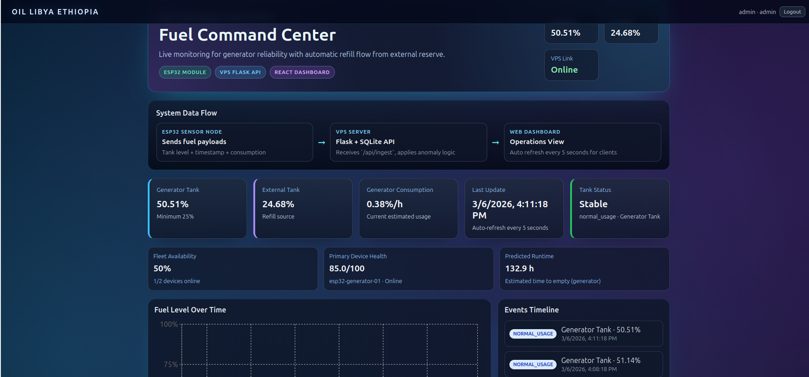
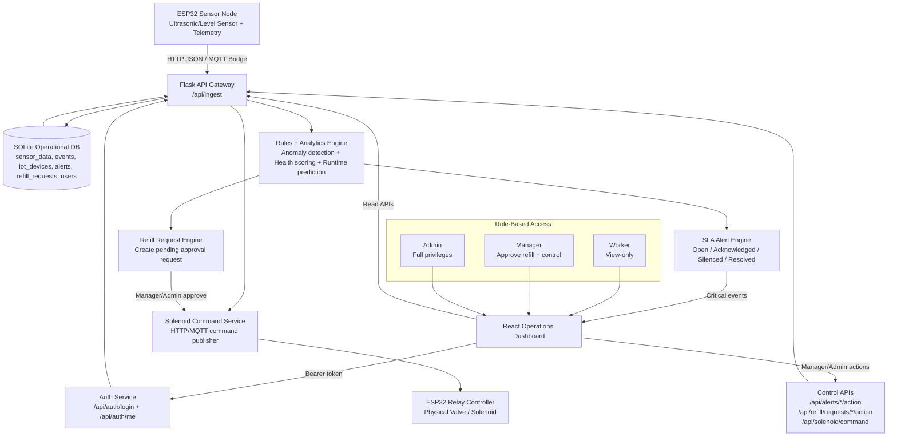

# OIL LIBYA ETHIOPIA – Fuel Monitoring Platform

A full-stack platform for monitoring tank fuel levels with anomaly detection, IoT reliability scoring, and live operational dashboarding.

## Dashboard Preview



## Monorepo Structure

- `backend/` Flask API + SQLite storage + seed generator
- `frontend/` React + Vite dashboard

## Features

### Backend

- Flask API endpoints:
  - `GET /api/health`
  - `GET /api/metrics`
  - `GET /api/events` (last 50 events)
  - `GET /api/iot/overview` (fleet health, connectivity, quality)
  - `GET /api/alerts` (open SLA alerts)
  - `POST /api/alerts/<alert_key>/action` (acknowledge/silence/resolve)
  - `GET /api/refill/requests` (refill approval queue)
  - `POST /api/refill/requests/<id>/action` (approve/reject)
  - `POST /api/auth/login` (username/password login)
  - `GET /api/auth/me` (token session validation)
  - `POST /api/ingest`
- SQLite operational database (`backend/fuel_monitor.db`)
- Event classification rules:
  - `abnormal_drop` when fuel decreases more than 10% within 10 minutes
  - `refill` when fuel increases more than 8% within 10 minutes
  - otherwise `normal_usage`
- IoT reliability analytics:
  - Device registry (`device_id`, firmware, battery, RSSI)
  - Sensor quality score (0-100) and health score (0-100)
  - Offline/degraded/online fleet status from telemetry heartbeat
  - Predicted runtime (hours-to-empty) using live consumption rate
- Structured JSON logging to console
- Persisted SLA alert lifecycle:
  - Device offline, degraded, and low battery alerts
  - Generator low autonomy and low fuel alerts
  - Open/resolved alert state with deduplicated alert keys
- Role-based access control (RBAC):
  - `worker`: read-only visibility (fuel levels, events, alerts, queue)
  - `manager`: can approve/reject refill requests and control operational actions
  - `admin`: manager permissions + privileged resolution actions

### Default Users (change in production)

- `worker` / `Worker@123`
- `manager` / `Manager@123`
- `admin` / `Admin@123`

Use environment variables to override defaults:

- `DEFAULT_WORKER_PASSWORD`
- `DEFAULT_MANAGER_PASSWORD`
- `DEFAULT_ADMIN_PASSWORD`

### Frontend

- React + Vite dashboard
- Top bar branding: **OIL LIBYA ETHIOPIA**
- KPI cards for fuel level, consumption rate, last update, tank status
- Line chart for fuel trend (from events)
- Events timeline list
- Auto refresh every 5 seconds
- SLA alert queue and critical-alert banner
- Responsive layout for desktop/tablet/mobile

## Ubuntu Local Setup

### Prerequisites

- Python 3.10+
- Node.js 18+
- npm 9+

### Option A: One command (starts both services)

```bash
cd /home/nurye/Desktop/oil-libya-ethiopia
chmod +x start-all.sh
./start-all.sh
```

This command will:
1. Create backend virtual environment if missing
2. Install backend dependencies
3. Seed baseline operational data
4. Start Flask API at `http://localhost:5000`
5. Install frontend dependencies
6. Start Vite at `http://localhost:5173`

### Option B: Manual startup (two terminals)

#### Terminal 1 – Backend

```bash
cd /home/nurye/Desktop/oil-libya-ethiopia/backend
python3 -m venv .venv
source .venv/bin/activate
pip install -r requirements.txt
python seed.py
python app.py
```

#### Terminal 2 – Frontend

```bash
cd /home/nurye/Desktop/oil-libya-ethiopia/frontend
npm install
npm run dev -- --host
```

Open: `http://localhost:5173`

## API Examples

### Health

```bash
curl http://localhost:5000/api/health
```

### Metrics

```bash
curl http://localhost:5000/api/metrics
```

### Events

```bash
curl http://localhost:5000/api/events
```

### IoT fleet overview

```bash
curl http://localhost:5000/api/iot/overview
```

### Open SLA alerts

```bash
curl "http://localhost:5000/api/alerts?refresh=true&limit=50"
```

### Operator alert actions (RBAC)

Authenticate first and pass bearer token in `Authorization` header.

- `acknowledge`: manager/admin
- `silence`: manager/admin (with `silence_minutes`)
- `resolve`: admin only

```bash
TOKEN=$(curl -s -X POST "http://localhost:5000/api/auth/login" \
  -H "Content-Type: application/json" \
  -d '{"username":"admin","password":"Admin@123"}' | python -c "import sys, json; print(json.load(sys.stdin)['token'])")

curl -X POST "http://localhost:5000/api/alerts/device-offline:esp32-generator-01/action" \
  -H "Content-Type: application/json" \
  -H "Authorization: Bearer $TOKEN" \
  -d '{"action":"resolve"}'
```

### Refill approval workflow

By default, when generator level drops below threshold, the platform creates a pending refill request instead of executing transfer automatically. Managers/admins must approve.

List requests:

```bash
curl "http://localhost:5000/api/refill/requests?status=pending&limit=20"
```

Approve request:

```bash
TOKEN=$(curl -s -X POST "http://localhost:5000/api/auth/login" \
  -H "Content-Type: application/json" \
  -d '{"username":"manager","password":"Manager@123"}' | python -c "import sys, json; print(json.load(sys.stdin)['token'])")

curl -X POST "http://localhost:5000/api/refill/requests/1/action" \
  -H "Content-Type: application/json" \
  -H "Authorization: Bearer $TOKEN" \
  -d '{"action":"approve"}'
```

Set `REFILL_APPROVAL_REQUIRED=false` to restore direct auto-refill behavior.

### Ingest sample sensor payload

```bash
curl -X POST http://localhost:5000/api/ingest \
  -H "Content-Type: application/json" \
  -d '{
    "device_id": "esp32-generator-01",
    "tank_name": "Tripoli Main Tank",
    "fuel_level": 62.4,
    "consumption_rate": 1.1,
    "battery_voltage": 3.84,
    "signal_rssi": -71,
    "firmware_version": "1.4.2",
    "expected_interval_seconds": 180,
    "timestamp": "2026-03-04T08:30:00Z"
  }'
```

## Seed Data

Generate synthetic sensor history + events:

```bash
cd backend
source .venv/bin/activate
python seed.py
```

## ESP32 Telemetry Simulator

Use the simulator to stress telemetry ingestion and trigger SLA policies:

```bash
cd backend
source .venv/bin/activate
python iot_simulator.py --endpoint http://localhost:5000 --count 40 --interval 3 --anomaly-every 8
```

## Full System Operation (Hardware + Software)

This platform runs as an integrated cyber-physical system with closed-loop control:

- **Hardware layer**: ESP32 sensor nodes read tank levels and send telemetry (fuel level, RSSI, battery, firmware) to the platform.
- **Edge-to-cloud transport**: telemetry is pushed to the Flask API (`/api/ingest`) over HTTP (or MQTT bridge mode where configured).
- **Decision layer**: backend classifies anomalies, computes device health/quality, predicts runtime, and raises SLA alerts.
- **Control governance layer**: when generator fuel drops below threshold, the system creates a **refill approval request**; manager/admin approval is required before execution.
- **Actuation layer**: approved refill triggers solenoid command dispatch (`OPEN`/`CLOSE`) and logs control history for audit.
- **Operations UI layer**: React dashboard provides live visibility for workers and privileged control actions for manager/admin roles.

### Working integration status

- Telemetry ingestion, analytics, alerts, refill approval, and command dispatch are all connected and operational in current code.
- RBAC is enforced with authenticated token sessions (`worker`, `manager`, `admin`) so control actions are protected.
- The architecture supports direct VPS hosting and can be adapted to industrial deployments with secure network segments.

## Complete Architecture (Mermaid)



### Architecture description

- **ESP32 Sensor Node** sends raw telemetry to the platform.
- **Flask API Gateway** validates telemetry and routes it to analytics, alerts, and control workflows.
- **SQLite Operational DB** persists all time-series, events, alerts, approvals, commands, and user metadata.
- **Rules + Analytics Engine** transforms telemetry into operational intelligence.
- **SLA Alert Engine** tracks incident lifecycle and supports acknowledge/silence/resolve workflows.
- **Refill Request Engine** ensures governance by requiring manager/admin approval before refill execution.
- **Auth Service** issues signed tokens and enforces role-based authorization.
- **React Operations Dashboard** presents live status and role-specific actions.
- **Solenoid Command Service + ESP32 Relay Controller** closes the loop from analytics to physical actuation.

## Screenshots Instructions

1. Run both services.
2. Open dashboard at `http://localhost:5173`.
3. Capture screenshots of:
   - Full dashboard view
   - Alert banner state when latest event is `abnormal_drop`
   - Events timeline + chart visible
4. Save images under `docs/screenshots/` with names:
   - `dashboard-main.png`
   - `dashboard-alert.png`
   - `dashboard-timeline.png`
5. Add links in this README under a `## Screenshots` section, for example:

```md
## Screenshots


```
